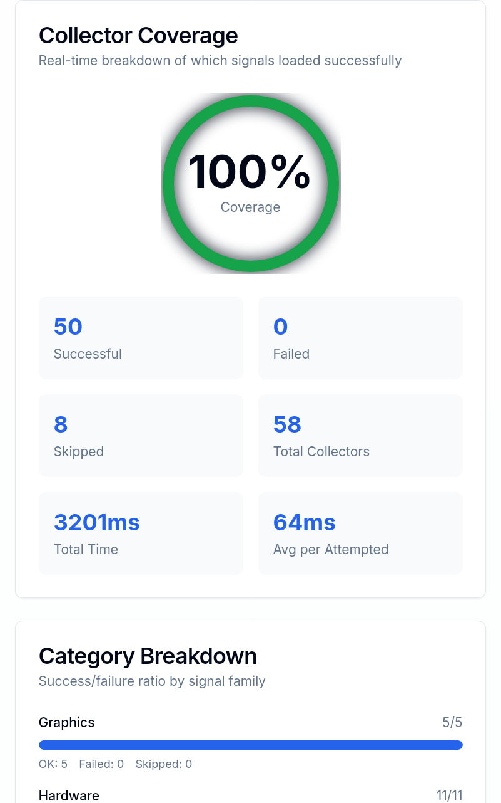

# Archonum examples

Small, self-contained examples showing how to use [Archonum](https://archonum.com)
from your own code.

- **CDP** — connect to a remote browser over the Chrome DevTools Protocol and
  drive it with Playwright. No local browser needed; Archonum _is_ the browser.
- **Proxy** — fetch a per-country HTTP proxy and route normal requests through it.

The CDP examples open the [creepjs](https://creepjs.org/checker) fingerprint
checker and capture its **Collector Coverage** panel — a quick way to see the
remote browser passing real-browser signal checks:

<p align="center">
  
</p>

Each example lives in its own folder under [`examples/`](examples) with its own
README, `Dockerfile`, and `docker-compose.yml`.

| Example                                          | Language | What it does                                          |
| ------------------------------------------------ | -------- | ----------------------------------------------------- |
| [`examples/cdp-python`](examples/cdp-python)     | Python   | Drive a remote browser over CDP (Playwright)          |
| [`examples/cdp-nodejs`](examples/cdp-nodejs)     | Node.js  | Drive a remote browser over CDP (Playwright)          |
| [`examples/proxy-python`](examples/proxy-python) | Python   | HTTP request through a per-country proxy (`requests`) |
| [`examples/proxy-nodejs`](examples/proxy-nodejs) | Node.js  | HTTP request through a per-country proxy (`fetch`)    |

## Credentials

All examples read configuration from a `.env` file (copy each folder's
`.env.example`). The core values:

| Variable            | Used by  | Purpose                                           |
| ------------------- | -------- | ------------------------------------------------- |
| `ARCHONUM_TOKEN`    | all      | Your Archonum API token                           |
| `ARCHONUM_COUNTRY`  | all      | Exit country, e.g. `us`                           |
| `ARCHONUM_BASE_URL` | all      | API base, defaults to `https://app.archonum.com`  |
| `ARCHONUM_CDP_*`    | CDP only | Gateway-mode credentials (alternative to the API) |

## Quick start

```bash
cd examples/cdp-python      # or any other example
cp .env.example .env        # fill in ARCHONUM_TOKEN + ARCHONUM_COUNTRY
docker compose up --build
```

## How it works

Archonum exposes an API:

```
# A per-country remote browser (CDP endpoint)
GET /api/v1/browsers/?country=us&session=example   Authorization: Token <token>
-> { "endpoint_url": "ws://…", "country": "US", "country_name": "United States" }

# A per-country HTTP proxy
GET /api/v1/proxies/?country=us&session=example     Authorization: Token <token>
-> { "host": "…", "http_port": 1234, "username": "…", "password": "…", … }
```

`session` is an arbitrary string — reuse the same value to keep the same exit
across requests, change it to rotate.

## License

[MIT](LICENSE)
